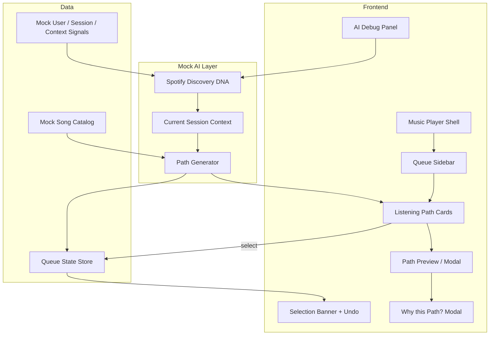

# AI Listening Paths — Phase-wise MVP Development Plan

This plan translates the [problem statement](./problemStatement.md) and [wireframes](./wireframes/) into a buildable MVP. The goal is a working prototype that feels like a natural extension of Spotify's Queue experience, with **all AI outputs mocked** — no real recommendation algorithm.

**Design source of truth:** [`docs/wireframes/`](./wireframes/) — refer to these files strictly when implementing UI, layout, copy, and flow. PRD takes precedence on naming where it explicitly differs (e.g. *Fit This Moment* vs wireframe *Match My Mood*).

> **Viewport rule:** [`web_wireframes.png`](./wireframes/web_wireframes.png) is **website / desktop only**. [`mobile_wireframe.png`](./wireframes/mobile_wireframe.png) is **mobile only**. Never implement desktop layout from the mobile file or vice versa — shared logic only (paths, copy, queue behavior).

---

## Wireframes

| File | Viewport | Use for |
|------|----------|---------|
| [web_wireframes.png](./wireframes/web_wireframes.png) | **Website / desktop** | 3-column shell (nav + main + queue sidebar), path cards in right sidebar, hover expand, expanded preview modal, "Why this Path?" modal, 4-step flow (top row) |
| [mobile_wireframe.png](./wireframes/mobile_wireframe.png) | **Mobile** | Now Playing screen, queue sheet below player, **vertically stacked** full-width path cards, tap-to-expand, bottom nav, 4-step mobile flow |

See also: [wireframes/README.md](./wireframes/README.md)

### Responsive implementation rule

| Breakpoint | Wireframe to follow | Layout summary |
|------------|---------------------|----------------|
| Desktop (`≥1024px`) | [web_wireframes.png](./wireframes/web_wireframes.png) | Queue in right sidebar; path cards in sidebar; hover interactions |
| Mobile (`<1024px`) | [mobile_wireframe.png](./wireframes/mobile_wireframe.png) | Full-screen player + scrollable queue; stacked cards; tap interactions |

### Web wireframe — screen index

*Source: [web_wireframes.png](./wireframes/web_wireframes.png) only — desktop / website.*

| # | Wireframe label | Phase |
|---|---|---|
| 1 | Currently Playing (queue closed / player) | 0 |
| 2 | AI Listening Paths in Queue (Preview + Next Song) | 1, 2 |
| 3 | User Chooses a Path | 5 |
| 4 | Queue Builds Accordingly | 5 |
| — | Expanded Path Preview (4-song carousel + Choose this path) | 3 |
| — | Queue After Selection (banner persists) | 5 |
| — | Why this Path? (AI Explanation modal) | 6 |
| — | How it works at a glance (4-step diagram) | 6 (optional onboarding) |
| — | AI under the hood (Context Engine, Taste Profile, Session Signals) | 4 |

### Mobile wireframe — screen index

*Source: [mobile_wireframe.png](./wireframes/mobile_wireframe.png) only — mobile.*

| # | Wireframe label | Phase |
|---|-----------------|-------|
| 1 | Currently Playing | 0, 7 |
| 2 | AI Listening Paths in Queue (BETA) — stacked cards | 1, 2, 7 |
| 3 | User Chooses a Path (banner + Undo) | 5 |
| 4 | Queue Builds Accordingly | 5 |

### Wireframe mock content (use in mocks)

Align seed data with wireframe previews unless PRD overrides:

| Path | Wireframe "Next up" track | Tags (wireframe) |
|------|---------------------------|------------------|
| Stay in the Vibe | *BIRDS OF A FEATHER* — Billie Eilish | Familiar, Comfortable, Safe |
| Discover Something New | *Good Luck, Babe!* — Chappell Roan | New, Exciting, High discovery |
| Match My Mood / Fit This Moment | *Sunset Lover* — Petit Biscuit | Mood-based, Contextual, Personal |

Currently playing (both wireframes): *LUNCH* — Billie Eilish.

---

## MVP Scope Summary

| In scope | Out of scope |
|----------|--------------|
| Queue-integrated AI Listening Paths section | Redesigning the music player |
| Three path cards with preview and selection | Real ML / collaborative filtering |
| Mock Spotify Discovery DNA context engine | Production Spotify API integration |
| Hover ([web](./wireframes/web_wireframes.png)) and tap ([mobile](./wireframes/mobile_wireframe.png)) preview | User accounts, auth, cloud sync |
| Queue rebuild on path selection + Undo | Feedback loop that learns over time (stub only) |
| "Why this Path?" explanation modal | Weather/location live APIs (mock signals) |
| Hidden AI Debug Panel (prototype only) | Native mobile apps |

---

## Architecture Overview



---

## Phase 0 — Project Foundation

**Goal:** Establish the repo, design tokens, and a Spotify-faithful shell so later phases plug into a stable base.

### Deliverables

- [ ] Initialize web app (React + TypeScript recommended; Vite or Next.js)
- [ ] Folder structure: `components/`, `features/listening-paths/`, `mocks/`, `types/`, `hooks/`, `styles/`
- [ ] Spotify-inspired design tokens: dark theme, typography, spacing, card radii, accent colors for paths
  - **Stay in the Vibe** — green
  - **Discover Something New** — purple
  - **Fit This Moment** — orange (wireframe: "Match My Mood")
- [ ] **Website layout** per [web_wireframes.png](./wireframes/web_wireframes.png): left nav + main content + right queue sidebar
- [ ] **Mobile layout** per [mobile_wireframe.png](./wireframes/mobile_wireframe.png): Now Playing screen + queue sheet + bottom nav
- [ ] Responsive switch at breakpoint (`≥1024px` → web wireframe; `<1024px` → mobile wireframe)
- [ ] Mock "currently playing" track: *LUNCH* — Billie Eilish (see [Wireframes](#wireframes))
- [ ] Mock default queue (5–10 tracks) below the paths section

### Acceptance criteria

- App loads with player + queue visible
- Visual language matches Spotify dark UI (not a full redesign)
- No Listening Paths UI yet — only placeholder region in queue

### Estimated effort

2–3 days

---

## Phase 1 — Queue Integration & Section Layout

**Goal:** Implement Screen 1 → Screen 2 from the PRD: Queue opens with the correct section order.

### Deliverables

- [ ] Queue sidebar component with sections in order:
  1. **Next in Queue** (existing default queue preview)
  2. **AI Listening Paths** (new)
  3. **Default Spotify Queue** (remainder)
- [ ] Section header: `AI Listening Paths` + subtitle *Choose how your listening journey continues.*
- [ ] Optional beta label: `AI Listening Paths (BETA)` per wireframe
- [ ] **Website:** queue right sidebar; path cards per [web_wireframes.png](./wireframes/web_wireframes.png)
- [ ] **Mobile:** queue below Now Playing; path cards **stacked vertically** per [mobile_wireframe.png](./wireframes/mobile_wireframe.png)
- [ ] Dismiss row: **No thanks, let Spotify decide** — hides paths section for the session; queue unchanged

### Acceptance criteria

- Tapping Queue shows Screen 2 from the correct wireframe for the current viewport (web vs mobile)
- Ignoring paths leaves default queue behavior intact
- Section is visually distinct but not intrusive

### Dependencies

Phase 0

### Estimated effort

2 days

---

## Phase 2 — Listening Path Cards (Collapsed State)

**Goal:** Render the three path preview cards with static mock content.

### Deliverables

- [ ] `ListeningPathCard` component with variants per path type
- [ ] Per card (collapsed):
  - Path title and one-line description
  - **Next up** preview: album art, song name, artist
  - Tag chips per [wireframes](./wireframes/) (PRD aliases in parentheses):
    - Stay in the Vibe → Familiar, Comfortable, Safe
    - Discover Something New → New, Exciting, High discovery (PRD: Discovery, High Match, Fresh Picks)
    - Fit This Moment → Mood-based, Contextual, Personal (wireframe: Match My Mood; PRD: Context Aware, Personalized, Right Now)
- [ ] Color-coded card borders/backgrounds per path
- [ ] TypeScript types: `ListeningPath`, `Track`, `PathTag`

### Mock data (initial)

Create `mocks/listeningPaths.ts` with three path objects, each containing:

- `id`, `type`, `title`, `description`, `tags[]`
- `previewTrack` (first song)
- `upcomingTracks` (min. 3 for preview; 4+ for expanded modal per wireframe)
- `estimatedDuration` (e.g. `~45 min`)
- `aiExplanation` (one-line string)

### Acceptance criteria

- All three cards render with viewport-correct layout (web sidebar vs mobile stack)
- No selection or queue mutation yet

### Dependencies

Phase 1

### Estimated effort

2–3 days

---

## Phase 3 — Path Preview Interaction (Web Hover + Mobile Tap)

**Goal:** Implement Screen 3 — preview without committing queue changes. **Web and mobile use different interaction patterns** (see respective wireframes).

### Deliverables

- [ ] **Website** ([web_wireframes.png](./wireframes/web_wireframes.png)): smooth card expand on **hover**
  - First 3 upcoming songs (art, title, artist)
  - Estimated queue duration
  - AI one-line explanation
  - CTA: **Choose this path**
- [ ] **Website:** expanded preview **modal** (4-song carousel + Choose this path) per web wireframe bottom row
- [ ] **Mobile** ([mobile_wireframe.png](./wireframes/mobile_wireframe.png)): first **tap** expands card; tap CTA to select (per PRD)
- [ ] Preview must **not** alter the live queue on either viewport

### Acceptance criteria

- Preview matches the active viewport wireframe; queue unchanged until explicit selection
- **Web:** hover expand + optional modal; leaving hover collapses without side effects
- **Mobile:** tap expand → CTA select per [mobile_wireframe.png](./wireframes/mobile_wireframe.png)
- Animations feel smooth, low cognitive load

### Dependencies

Phase 2

### Estimated effort

3–4 days

---

## Phase 4 — Mock Spotify Discovery DNA

**Goal:** Replace hard-coded path copy with a deterministic mock context engine — the "under the hood" layer from the wireframes.

### Deliverables

- [ ] `discoveryDna/` module:
  - **Inputs:** mock user, session, context, and behaviour signals (see PRD signal lists)
  - **Output:** `CurrentSessionContext` (e.g. Evening Relaxation, Morning Commute)
  - **Output:** `discoveryReadiness`, `preferredListeningIntent`
- [ ] `generateListeningPaths(context, currentTrack, catalog)` → three `ListeningPath` objects
- [ ] Logic is **rule-based / seeded**, not ML — e.g. time-of-day + weather mock → context label; context → path titles, tags, explanations, and track picks from mock catalog
- [ ] Paths remain stable for a session unless signals change (optional: refresh on track change)

### Mock signal sources

| Signal | MVP approach |
|--------|----------------|
| Time of day / day of week | `Date` or injected mock |
| Weather | Static mock or simple toggle in debug panel |
| Device type | `navigator.userAgent` or mock |
| Location category | Mock enum: home, commute, gym |
| Skip / repeat / session | Pre-seeded mock session object |
| Taste profile | Mock genre affinities + followed artists |

### Acceptance criteria

- Changing mock context (via debug panel) updates path explanations and track selections
- Same inputs produce same outputs (deterministic for demos)
- No external AI API calls

### Dependencies

Phase 2

### Estimated effort

3–4 days

---

## Phase 5 — Path Selection, Queue Rebuild & Undo

**Goal:** Implement Screen 4 → Screen 5: choosing a path updates the queue; user can revert.

### Deliverables

- [ ] **Choose this path** action:
  - Highlight selected card
  - Rebuild **upcoming queue** from chosen path's track list (append after "Next in Queue" or replace default upcoming — document chosen behavior; wireframe implies replacement of suggested upcoming tracks)
- [ ] Confirmation UI:
  - Banner: `You chose: Discover Something New` (or selected path name)
  - Status: `Listening Path Updated ✓`
  - **Undo** control restores pre-selection queue snapshot
- [ ] Collapse/hide path cards after selection (optional) or keep banner + dimmed cards per wireframe
- [ ] Queue state management: snapshot before selection, active path id, undo stack (single level for MVP)
- [ ] Selecting a different path replaces queue again from new snapshot base

### Acceptance criteria

- Selection updates visible queue list immediately
- Undo restores exact prior queue
- Playback UI unchanged; only queue content differs
- "No thanks" still works and never mutates queue

### Dependencies

Phases 3, 4

### Estimated effort

3 days

---

## Phase 6 — AI Transparency & Debug Panel

**Goal:** Build trust features from wireframes and PRD — explainability for users; visibility for prototype reviewers.

### Deliverables

- [ ] **"Why this Path?" modal** (per path):
  - Current Mood / Session Context
  - Listening History insight (e.g. "You enjoy soft pop")
  - Activity (e.g. "Light activity detected")
  - Discovery Readiness (e.g. Moderate / 82%)
  - Entry point: link or icon on expanded card or banner
- [ ] **Hidden AI Debug Panel** (prototype only):
  - Toggle via small **AI** badge (keyboard shortcut optional, e.g. `Ctrl+Shift+D`)
  - Shows Discovery DNA output: context, readiness, primary signals checklist, generated paths
  - Controls to override mock signals (time, weather, location, readiness) for demos

### Acceptance criteria

- Every path has a human-readable explanation accessible in ≤2 clicks
- Debug panel is not visible in default user flow
- Debug overrides re-run path generation (Phase 4)

### Dependencies

Phase 4, 5

### Estimated effort

2–3 days

---

## Phase 7 — Responsive Polish, Accessibility & MVP Hardening

**Goal:** Ship a demo-ready MVP where **website matches [web_wireframes.png](./wireframes/web_wireframes.png)** and **mobile matches [mobile_wireframe.png](./wireframes/mobile_wireframe.png)**.

### Deliverables

- [ ] Verify breakpoint handoff: desktop uses web wireframe layout; mobile uses mobile wireframe layout (no hybrid)
- [ ] Mobile: full-width stacked path cards, touch targets ≥44px, bottom nav per mobile wireframe
- [ ] Website: queue sidebar, hover states, modals per web wireframe
- [ ] Keyboard: focus order, Enter to select, Escape to close modals
- [ ] `prefers-reduced-motion` support for expand/collapse
- [ ] Empty/error states: DNA fails → hide paths section, default queue only
- [ ] Loading skeleton for path cards (simulate short async fetch even if mock)
- [ ] README: how to run, demo script, signal overrides
- [ ] Light manual test checklist (see below)

### Acceptance criteria

- Website and mobile each match their dedicated wireframe file end-to-end
- No console errors; TypeScript strict passes
- Demo script reproducible in <5 minutes

### Dependencies

All prior phases

### Estimated effort

2–3 days

---

## Screen-to-Phase Mapping

| Wireframe / PRD screen | Website source | Mobile source | Phase |
|------------------------|----------------|---------------|-------|
| Screen 1 — Music Player | [web](./wireframes/web_wireframes.png) #1 | [mobile](./wireframes/mobile_wireframe.png) #1 | 0 |
| Screen 2 — Queue with AI Listening Paths | [web](./wireframes/web_wireframes.png) #2 | [mobile](./wireframes/mobile_wireframe.png) #2 | 1, 2 |
| Screen 3 — Path Preview | [web](./wireframes/web_wireframes.png) hover + expanded modal | [mobile](./wireframes/mobile_wireframe.png) tap expand | 3 |
| Screen 4 — Queue Updated + banner + Undo | [web](./wireframes/web_wireframes.png) #3–4 | [mobile](./wireframes/mobile_wireframe.png) #3 | 5 |
| Screen 5 — Continue Listening | [web](./wireframes/web_wireframes.png) queue after selection | [mobile](./wireframes/mobile_wireframe.png) #4 | 5 |
| Expanded Path Preview modal | [web](./wireframes/web_wireframes.png) only | — | 3 |
| "Why this Path?" modal | [web](./wireframes/web_wireframes.png) only | adapt as bottom sheet on mobile if needed | 6 |
| How it works at a glance | [web](./wireframes/web_wireframes.png) | [mobile](./wireframes/mobile_wireframe.png) | 6 (optional) |
| AI Debug Panel | PRD only | PRD only | 6 |
| Context engine / Discovery DNA | [web](./wireframes/web_wireframes.png) | [mobile](./wireframes/mobile_wireframe.png) bottom | 4 |

---

## Suggested API Shape (Mock Backend)

Even with a frontend-only MVP, define interfaces early so a future backend swap is trivial.

```
GET  /api/session/context          → CurrentSessionContext + signals
GET  /api/listening-paths          → { paths: ListeningPath[3] }
POST /api/listening-paths/select     → { pathId } → updated queue
POST /api/listening-paths/undo       → restored queue
GET  /api/listening-paths/:id/why    → explanation breakdown
```

Implement as in-memory mock services in Phase 4; optional MSW (Mock Service Worker) for realistic loading states.

---

## Data Models (Core Types)

```typescript
type PathType = 'stay-in-vibe' | 'discover-new' | 'fit-moment';

interface Track {
  id: string;
  title: string;
  artist: string;
  albumArtUrl: string;
  durationMs: number;
}

interface ListeningPath {
  id: string;
  type: PathType;
  title: string;
  description: string;
  tags: string[];
  previewTrack: Track;
  upcomingTracks: Track[];
  estimatedDurationLabel: string; // "~45 min"
  aiExplanation: string;
}

interface SessionContext {
  label: string; // "Evening Relaxation"
  discoveryReadiness: number; // 0–100
  primarySignals: string[];
  mood?: string;
  activity?: string;
}

interface WhyThisPathExplanation {
  currentMood: string;
  listeningHistoryInsight: string;
  activity: string;
  discoveryReadiness: string;
}
```

---

## Testing & Demo Checklist

- [ ] Open queue → three paths visible below Next in Queue (layout per viewport wireframe)
- [ ] **Website:** hover path → preview; queue unchanged ([web_wireframes.png](./wireframes/web_wireframes.png))
- [ ] **Mobile:** tap to expand → CTA to select ([mobile_wireframe.png](./wireframes/mobile_wireframe.png))
- [ ] Choose path → queue updates; banner shows with Undo
- [ ] Undo → original queue restored
- [ ] "No thanks" → paths hidden; default queue unchanged
- [ ] "Why this Path?" → shows context breakdown (web modal; mobile bottom sheet if adapted)
- [ ] AI Debug Panel → toggle signals; paths regenerate
- [ ] Ignore paths entirely → listening continues normally

---

## Timeline Estimate

| Phase | Duration | Cumulative |
|-------|----------|------------|
| 0 — Foundation | 2–3 days | ~3 days |
| 1 — Queue layout | 2 days | ~5 days |
| 2 — Path cards | 2–3 days | ~8 days |
| 3 — Preview UX | 3–4 days | ~12 days |
| 4 — Mock Discovery DNA | 3–4 days | ~16 days |
| 5 — Selection & Undo | 3 days | ~19 days |
| 6 — Transparency & Debug | 2–3 days | ~22 days |
| 7 — Polish & Hardening | 2–3 days | ~25 days |

**Total MVP estimate: ~4–5 weeks** for one developer, assuming Spotify-like UI built from scratch. Phases 2–4 can overlap partially once types and layout exist.

---

## Parallelization Notes

- **Designer + dev:** Phases 0–2 can start from wireframes while DNA rules are spec'd.
- **Phase 4** can begin as soon as `ListeningPath` types exist (Phase 2), in parallel with Phase 3 UI.
- **Phase 6** debug panel is ideal for stakeholder demos during Phase 5 development.

---

## Post-MVP (Explicitly Deferred)

- Real feedback loop ("Smarter Over Time" from wireframes) — log interactions only; no model training
- Live Spotify Web API / playback SDK integration
- A/B experiment hooks for Growth
- Path refresh mid-session on skip-heavy behaviour
- Social sharing of a path

---

## Open Decisions (Resolve in Phase 0)

1. **Framework:** Vite SPA vs Next.js — either works; SPA is sufficient for queue-sidebar prototype.
2. **Queue mutation rule:** Replace all upcoming tracks vs insert path tracks after the first queued item — align with wireframe Screen 4 (recommend: replace upcoming default recommendations, keep explicitly user-queued items if any).
3. **Fit This Moment vs Match My Mood:** Use PRD naming (*Fit This Moment*) in UI; map wireframe orange card to this path.
4. **Modal vs inline expand:** Support both — inline for hover; modal optional for click-through preview with 4-song carousel.

---

## Reference

- [Problem Statement / PRD](./problemStatement.md)
- [Wireframes index](./wireframes/README.md)
  - **Website / desktop:** [web_wireframes.png](./wireframes/web_wireframes.png)
  - **Mobile:** [mobile_wireframe.png](./wireframes/mobile_wireframe.png)
